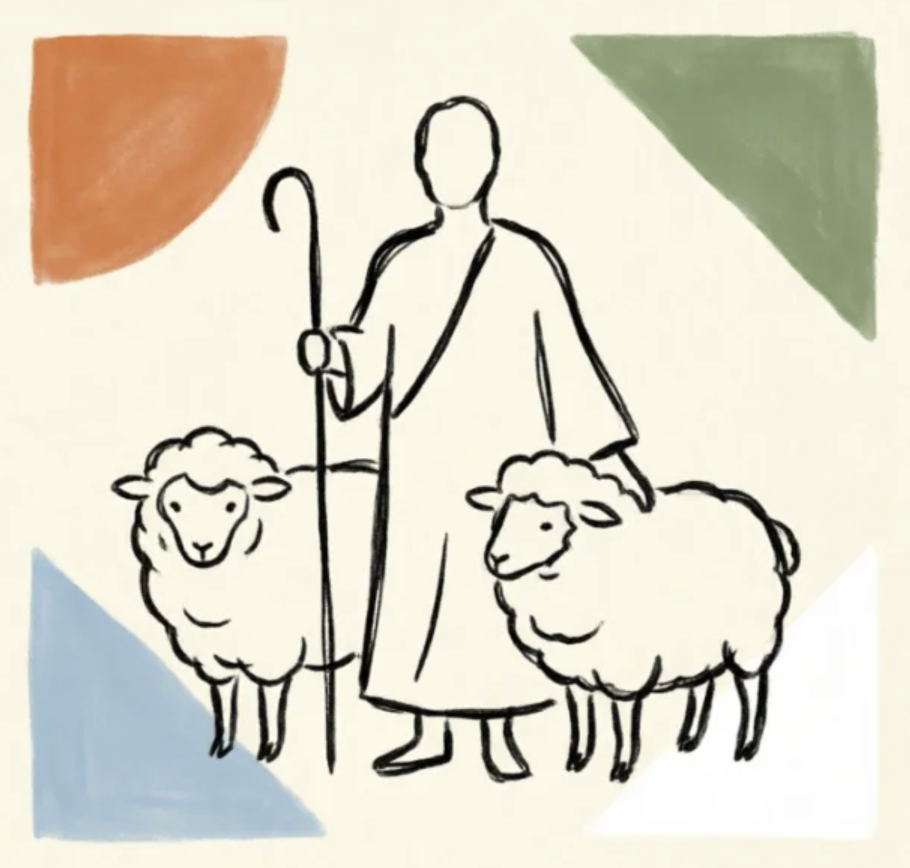

# Humanity

A warm, serif-first Obsidian theme with earthy tones.

## Design

- **Palette**: Warm parchment (`#faf9f5`), deep charcoal (`#141413`), terracotta accent (`#d97757`), sage green (`#788c5d`), soft blue (`#6a9bcc`)
- **Body text**: Lora + LXGW WenKai (CJK fallback)
- **Code**: JetBrains Mono
- **Light & dark mode** supported

## Features

- Serif-first typography optimized for long-form reading
- CJK-aware font stack (LXGW WenKai, Source Han Serif SC)
- Stable sidebar — no bold-on-hover animation
- Earthy callout colors (tip/note/warning/important)
- Pill-shaped tags, subtle scrollbar, refined table headers
- Graph view color integration

## Installation

### Manual

1. Download `theme.css` and `manifest.json`
2. Create folder: `<your-vault>/.obsidian/themes/Humanity/`
3. Place both files inside
4. Open Obsidian → Settings → Appearance → Theme → select **Humanity**

## Fonts

For the best experience, install these fonts:

- [Lora](https://fonts.google.com/specimen/Lora) — body text (Latin)
- [LXGW WenKai](https://github.com/lxgw/LxgwWenKai) — body text (CJK)
- [JetBrains Mono](https://www.jetbrains.com/lp/mono/) — code blocks

The theme gracefully falls back to Georgia / Songti SC / Menlo if these are not installed.

## License

[MIT](LICENSE)
